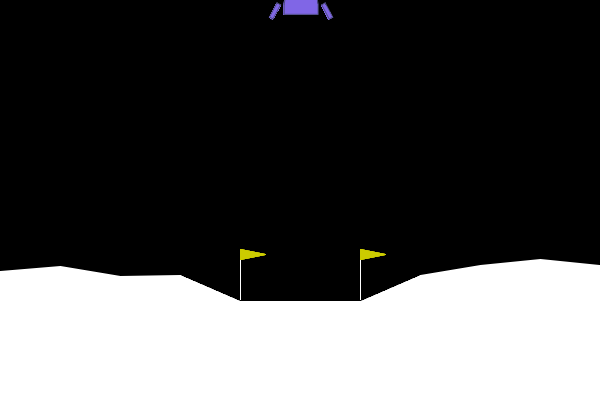
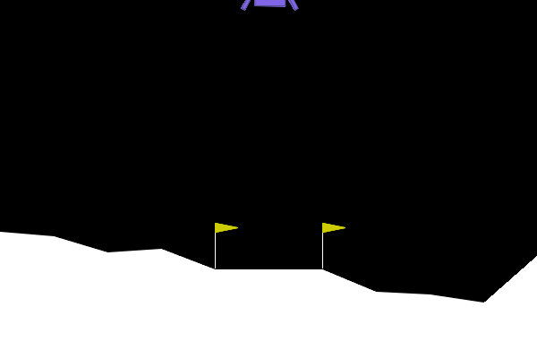

# Policy Gradients on LunarLander-v3

> REINFORCE, Actor-Critic, and the entropy bonus that taught my agent to hover forever instead of landing.

<p align="center">
  
</p>
<p align="center"><i>Actor-Critic agent — 237.06 mean reward, 87% success rate</i></p>

[](https://www.python.org/)
[](https://pytorch.org/)
[](https://gymnasium.farama.org/)

---

## TL;DR

Vanilla REINFORCE never solves LunarLander (−39.90 mean reward, 0% success). Adding a value baseline turns it into an agent that lands successfully **87% of the time** (237.06 mean reward) — the single decisive change in this project.

The interesting part came after. I added two standard "improvements" — return normalisation and an entropy bonus — expecting marginal gains. Instead, an entropy coefficient of β=0.01 **collapsed the success rate from 87% to 37%**.

The reward alone didn't reveal why. Episode duration did: 706 steps instead of 272. The agent had learned to **hover** — dodging the −100 crash penalty by never committing to the +100 landing. A local optimum induced by rewarding policy indecision. Dropping β to 0.001 recovered 84%.

---

## The three agents

| Random policy | REINFORCE | REINFORCE + baseline |
|:---:|:---:|:---:|
|  |  |  |
| **−183.18** · 0% solved | **−39.90** · 0% solved | **+237.06** · 87% solved |
| No relation between state and action. Crashes in ~90 steps. | Learned to stabilise and avoid immediate disaster, but never lands. | Learned the fine braking policy. Descends oriented, lands between the flags. |

---

## When "improvements" make things worse

<p align="center">
  
</p>
<p align="center"><i>β = 0.01 — the agent hovers indefinitely. 706 steps, 37% success.</i></p>

The entropy bonus adds a `−β·H(π)` term that rewards uncertain policies, encouraging exploration. Set too high, it rewards indecision so strongly that the agent finds a degenerate strategy: stay airborne forever. It never crashes (avoids −100) but never lands either (forfeits +100). Reward looks acceptable; the task is not solved.

| Configuration | Mean reward | Episode length | Solved |
|---|---|---|---|
| Baseline (no extras) | **237.06** | 272 steps | **87%** |
| + normalisation + entropy (β=0.01) | 157.22 | 706 steps | 37% |
| + normalisation + entropy (β=0.001) | 228.32 | 296 steps | 84% |

**Two takeaways.** First, mean reward is not enough to detect a broken policy — episode duration was the diagnostic signal. Second, the decisive improvement was the baseline itself; once the actor has an informative advantage signal, the optional extras add little and can actively hurt if miscalibrated.

---

## Full results

| Method | Mean reward | Std | Episode length | Solved (≥200) |
|---|---|---|---|---|
| Random policy | −183.18 | 119.75 | 90.34 | 0% |
| REINFORCE (vanilla) | −39.90 | 50.90 | 126.00 | 0% |
| REINFORCE + extras (β=0.01) | 118.64 | 65.49 | 957.72 | 0% |
| REINFORCE + extras (β=0.001) | 104.08 | 56.23 | 775.28 | 0% |
| **REINFORCE + baseline** | **237.06** | 76.93 | 271.65 | **87%** |
| + baseline + extras (β=0.01) | 157.22 | 79.94 | 706.47 | 37% |
| + baseline + extras (β=0.001) | 228.32 | 89.01 | 295.72 | 84% |

*Evaluation over 100 episodes with best weights. Training: 2000 episodes.*

---

## Why the baseline works

Vanilla REINFORCE scales the gradient by the absolute return of the full trajectory. One bad episode penalises *every* action taken in it — including the good ones. The gradient is unbiased but extremely noisy.

The baseline replaces the return `G_t` with the advantage `A_t = G_t − V(s_t)`. The question changes from *"was this trajectory good?"* to *"was this action better than expected from this state?"* — a far more precise signal.

A detail worth noting: in this experiment the baseline reduced training variance only modestly (175.42 → 160.23). Its real contribution wasn't smoothing the curve but **making the learning signal informative**. The moving average crosses the 200 threshold around episode ~900; vanilla REINFORCE stays in negative territory for all 2000.

**Implementation note:** the critic learns faster than the actor (`lr` 3e-3 vs 1e-3, plus 5 gradient steps per episode). This is deliberate — the actor's updates are only useful if `V(s)` is already reliable. An earlier version with a single critic step per episode neutralised the baseline's benefit entirely.

---

## Setup

| | |
|---|---|
| **Environment** | LunarLander-v3 (Gymnasium) — 8D continuous state, 4 discrete actions |
| **Solved threshold** | 200 reward |
| **Architecture** | MLP, 128 hidden units (both actor and critic) |
| **Optimiser** | Adam · γ=0.99 · gradient clipping at 1.0 |
| **Training** | 2000 episodes |
| **Evaluation** | 100 episodes, best weights |

---

## Running it

```bash
pip install -r requirements.txt
jupyter lab notebooks/Notebook.ipynb
```

---

## Full report

Detailed technical report (Spanish, 12 pages) with hyperparameter justification, training curves and per-exercise analysis: [`report/Report.pdf`](report/Report.pdf)

---

## Next steps

- **A2C/A3C** — online updates instead of Monte Carlo
- **PPO** — clipped policy updates for stability
- **GAE** — better bias-variance trade-off on the advantage estimate

---

Academic project for *Advanced Machine Learning*, BSc in Artificial Intelligence Engineering, Universidad de Alicante (2025/26).

**Dennis García Solera** — [GitHub](https://github.com/dgsolera-ai) · [LinkedIn](https://www.linkedin.com/in/dennisgarciasolera/)